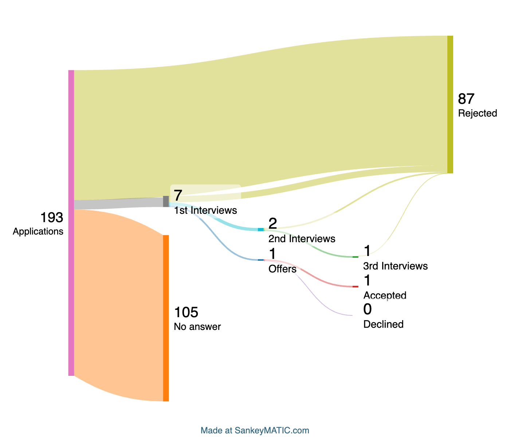

#            Job Search Tracker - Sankey Diagram 


# Overview
The goal of this project is to create a visual representation of my job search
using a Sankey diagram, which helps track the flow and status of job applications,
interviews, offers, and rejections. By leveraging the Gmail API, I fetch job-related
emails, categorize them with custom labels, and generate a Sankey diagram illustrating 
the progression of each application.

# Features
- Multi-Account Authentication: Authenticate and retrieve emails from multiple Gmail accounts.
- Label Management: Automatically fetch and categorize emails based on custom labels such as:
    - Applications
    - Interview (1st, 2nd, 3rd Round)
    - Offer
    - Accepted
    - Rejected
- Data Aggregation: Combine data from multiple accounts and ensure accurate tracking of email conversations.
- Sankey Diagram Generation: Use Selenium to interact with Sankeymatic.com to generate and download high-quality Sankey diagrams.
- Automatic Flow Creation: The flow includes:
    - Applications -> Interview -> Offers -> Acceptance/Rejection.
    - Clear distinction between rejections at each interview stage.

# Design Approach

## Steps Taken:
1. Manual Email Categorization: Tagged emails into categories using Gmail's filters and labels.
2. Fetching Labels: Utilized the Gmail API to retrieve labels and their associated message counts.
3. Sankeymatic Integration: Used Selenium to automate input submission on the Sankeymatic website and download the generated diagram.

## Challenges:
- Multi-account Authentication: Handling multiple Gmail accounts and merging label data.
- Filtering and Deduplication: Ensuring email chains and repeated messages are handled correctly.
- Label Accuracy : Ensuring the label counts retrieved using the Gmail Api are accurate.
- Automated Diagram Generation: Using Selenium to automate input on Sankeymatic and downloading the result.

# Getting Started

## Prerequisites:
- Python 3.x: Ensure Python is installed on your system.
- Selenium: Install the Selenium package for browser automation.
- Google API Client: Set up Gmail API and OAuth credentials.
- Google Chrome: Required for Selenium WebDriver to interact with Sankeymatic.

- To set up the Gmail Api and OAuth credenials visit: https://developers.google.com/workspace/guides/configure-oauth-consent

- Once you set up your Oauth credentials and setup your google project you should have a credentials.json file 

- Save it and put in the same directory as Sankey diagram
## Install Dependencies:
```bash
pip install selenium
```
## Analysis



### Understanding My Job Search Journey
Since high school, I have aspired to become a software engineer. Now, as a senior at the University of Minnesota nearing graduation, I’ve been actively applying for jobs in both tech and non-tech roles. However, breaking into the industry has been challenging, and I wanted to visualize my job search journey to identify patterns, setbacks, and areas for improvement.

Key Insights from My Job Applications:
- I submitted 193 applications, with approximately 93% focused on tech roles.

- Out of these, 105 applications received no response—no rejection email, interview invitation, or follow-up of any kind.

- I faced 87 rejections at various stages, with the majority occurring immediately after submission.

- I secured 7 interviews, progressing through different rounds in some cases.

- Ultimately, I received 1 job offer, but it was not for the software engineering roles I was aiming for.

### Major Takeaways
#### Difficulty Getting Past the Resume Stage:

1. A significant portion of my applications never progressed beyond submission. This suggests that my resume may not be optimized for applicant tracking systems (ATS) or isn't effectively showcasing my skills and experience. Improving my resume, tailoring applications,working on more projects and networking more could help increase my chances of securing interviews.

2. Not Enough Applications:

    While 193 applications may seem like a large number, breaking into the software engineering field—especially as a new grad—often requires a higher volume of applications. Given my current success rate, increasing the number of targeted applications could improve my chances of landing more interviews and offers.

### Next Steps
1. Resume Optimization: Improve formatting, highlight key projects, and tailor applications to match job descriptions more closely.

2. Networking: Engage more with recruiters, attend career fairs, and leverage LinkedIn for referrals.
Skill Development: Continue working on technical projects and sharpening interview skills to improve performance in future opportunities.


By analyzing my job search data through this Sankey diagram, I have a clearer picture of where I'm falling short and what steps I can take to improve my job search strategy.